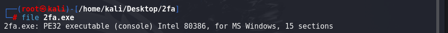
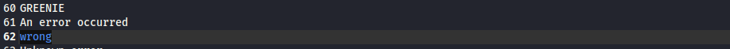
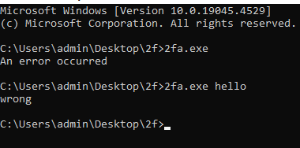
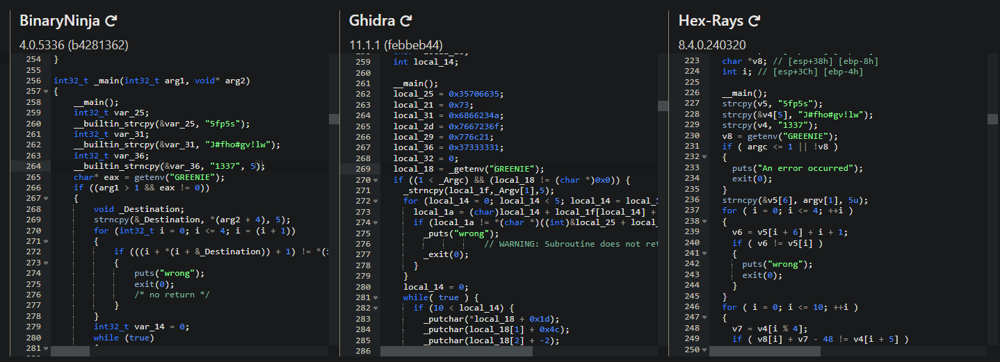

# Reverse engineering - 2fa.exe

## Disclaimer

This is a RE ctf taken from [here](https://cywar.hackeru.com/challenges/2-factor-auth). Chances are that you will not be able to get this file, so you can ask and we can get permission to share it.

### What do we have? Reconnaissance

Let's fire up the VM and explore the file.
After unzipping the archive we get the 2fa.exe file. Let's run a basic static enumeration.


We can indeed confirm that this is a 32 bit PE .exe file, with 15 sections (so we might explore section headers later).
Running strings on the file expectedly gives a lot of output, and among some dll calls, memory management and other syscalls there is a little of note.


We can see here however there are some manually inserted strings. Given the name of this challenge, as well the message "wrong", this gives an impression that there is a program flow "if" check for input. As well as "GREENIE" might be useful later.

objdump -x didn't reveal anything too exciting.

Let's jump into a windows VM, and quickly run the executable. I suspect we should be able to see the "wrong" message, as we do not have the correct string.



As expected, we get the "wrong" message when the first factor is incorrect, however when no input given we get what looks like a system error message.

### Delve deep

By this point it's clear that there is a numerical calculation that is checked with flow statements based on the argument input, so we have to delve into the source code to get further.

In terms of decompilation we have many great options: Ghidra, IDA, Angr and possibly more, but as one great man once said:


Going to the incredible [dogbolt](dogbolt.org) gives us precisely what we need:

And locating main is fairly straightforward, after we skip bunch of _init functions that set up the memory.
This is a very ugly C-Assembly source code. There is seemingly no difference which one to use, maybe except for the fact that Ghidra has unresolved memory references. Let's take Hex-Rays:

```C
int __cdecl main(int argc, const char **argv, const char **envp)
{
  char v4[17]; // [esp+1Ah] [ebp-26h] BYREF
  char v5[11]; // [esp+2Bh] [ebp-15h] BYREF
  char v6; // [esp+36h] [ebp-Ah]
  char v7; // [esp+37h] [ebp-9h]
  char *v8; // [esp+38h] [ebp-8h]
  int i; // [esp+3Ch] [ebp-4h]

  __main();
  strcpy(v5, "5fp5s");
  strcpy(&v4[5], "J#fho#gv!lw");
  strcpy(v4, "1337");
  v8 = getenv("GREENIE");

  //1
  if ( argc <= 1 || !v8 )
  {
    puts("An error occurred");
    exit(0);
  }
  //

  //2
  strncpy(&v5[6], argv[1], 5u);
  for ( i = 0; i <= 4; ++i )
  {
    v6 = v5[i + 6] + i + 1;
    if ( v6 != v5[i] )
    {
      puts("wrong");
      exit(0);
    }
  }
  //

  //3
  for ( i = 0; i <= 10; ++i )
  {
    v7 = v4[i % 4];
    if ( v8[i] + v7 - 48 != v4[i + 5] )
    {
      puts("wrong");
      exit(0);
    }
  }
  //

  //4
  putchar(*v8 + 29);
  putchar(v8[1] + 76);
  putchar(v8[2] - 2);
  putchar(v8[3] + 6);
  putchar(v8[4] + 13);
  putchar(v8[5] + 35);
  putchar(v8[6] + 21);
  putchar(v8[7] - 13);
  putchar(v8[8] + 19);
  putchar(v8[9] + 9);
  printf("%c\n", v8[10] + 9);
  //
  return 0;
}
```

Looking at the code couple of things pop out: strings *"5fp5s"*, *"J#fho#gv!lw"*, *"1337"* are used in calculations.

### Reverse it

1. We now know that *GREENIE* is an environment variable in windows that we have to create. Note that if GREENIE doesn't exist or no arguments provided, we **exit** the main function.

2. Based on the for loop we can reverse engineer the first argument string we must provide:

    ```C
    #include <stdio.h>

    int main()
    {
        char str[] = "5fp5s";
        char out;
        int i=0;
        for ( i = 0; i <= 4; ++i )
        {
            out = str[i]-i-1;
            printf("%c\n",out);
        }
        return 0;
    }
    ```

    And the output is: "4dm1n" (very clever)

3. We should be able to reverse the second string pretty much the same way:

    ```C
    #include <stdio.h>

    int main()
    {
        char v4[17];
        strncpy(&v4[5], "J#fho#gv!lw",11);
        strncpy(v4, "1337",4); 
        char out;
        int i;
        for(i = 0; i <= 10; i++)
        {
            out = (char)(v4[i+5] + 48 - v4[i%4]);
            printf("%c\n",out);
        }

        return 0;
    }
    ```

    And the output is: "I can do it"

    Since v8 is a pointer to the environment variable GREENIE, the string we found should be the value of that variable.

4. If we get to here, this is where the program ends, thus here is probably the flag. We run 2fa.exe 4dm1n in cmd and we get the flag `flag{Cyb3r}`, again very clever.

The end.
